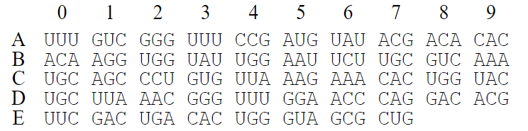
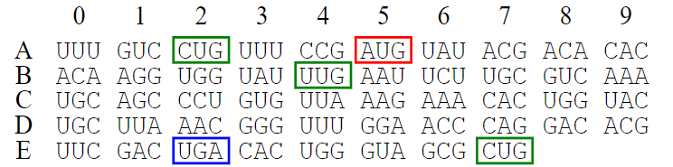

# STraN

STraN is **S**equence **Tra**nslator in .**N**ET (pronounce as strain)

- [STraN](#stran)
  - [Features](#features)
  - [Installation](#installation)
  - [Usage](#usage)
    - [オプション](#オプション)
    - [優先的な開始コドンとAlternativeな開始コドンについて](#優先的な開始コドンとalternativeな開始コドンについて)
    - [使用例](#使用例)

## Features

- 任意の遺伝暗号表を用いた翻訳が可能
- Ambigiousな塩基に対応
- Alternativeな開始コドンの設定が可能
- 翻訳後，サマリーファイルをTSVとして出力

## Installation

- [Release](https://github.com/Funny-Silkie/stran/releases)ページよりバージョンを選択
- お使いのコンピュータのOSに対応するファイルをダウンロード
- ファイルを解凍
- 実行ファイルをパスの通る場所に移動
- LinuxやMacの場合は要 `chmod`

## Usage

```sh
stran [-h] [-v] [-i file] [-o string] [-t string] [--start string] [--alt-start string] [--output-all-starts] [--only-complete]
```

`-i` オプションで核酸配列のFASTAを， `-o` オプションで出力ファイルを指定します。
`-t` オプションで遺伝暗号表を設定できます。
数値を指定した場合，対応するtransl_table IDのNCBIの遺伝暗号表を使用し，ファイルを指定した場合，指定したファイルの暗号表を用います。
ファイルのフォーマットはNCBIの暗号表と同様の形式となっています。
- AAs: アミノ酸の位置文字表記
- Starts: 開始コドンの可能性がある場合 `M`，終始コドンの可能性がある場合 `*`，それ以外は `-`
- Base1-3: 核酸塩基。`ATGC` のみ許容で，ハイフンなどは入れられません
- `#` で始まる行はコメントとして無視されます

**例**

```
  AAs  = ABCDEFGHIJ**KL*MNOPQRSTUVWXYZABCDEFGHIJKLMNOPQRSTUVWXYZABCDEFGHI
Starts = ---M------**--*----M---------------M----------------------------
Base1  = TTTTTTTTTTTTTTTTCCCCCCCCCCCCCCCCAAAAAAAAAAAAAAAAGGGGGGGGGGGGGGGG
Base2  = TTTTCCCCAAAAGGGGTTTTCCCCAAAAGGGGTTTTCCCCAAAAGGGGTTTTCCCCAAAAGGGG
Base3  = TCAGTCAGTCAGTCAGTCAGTCAGTCAGTCAGTCAGTCAGTCAGTCAGTCAGTCAGTCAGTCAG
```

出力ファイルは `-o` オプションで指定したFASTAファイルの他に，そのファイル名に `.tsv` のついたファイルも出力します。
このファイルは翻訳処理のサマリーを表し，開始・終了コドンやソース配列名などを記載します。
`-o` を指定しない場合，サマリーファイルは出力されません。

### オプション

| Short | Full                  |  Type / Default   | Description                                                    |
| ----: | :-------------------- | :---------------: | :------------------------------------------------------------- |
|  `-h` | `--help`              |       flag        | ヘルプの表示                                                   |
|  `-v` | `--version`           |       flag        | バージョンの表示                                               |
|  `-i` | `--in`                |  file / 標準入力  | 読み込むFASTAファイル                                          |
|  `-o` | `--out`               |  file / 標準出力  | 出力先FASTAファイル                                            |
|  `-t` | `--table`             | int or file / `1` | 使用する遺伝暗号表のIDまたはファイル名                         |
|       | `--start`             |  string / `AUG`   | 優先的に使用する開始コドン。複数指定可能                       |
|       | `--alt-start`         |   string / null   | Alternativeな開始コドン。複数指定可能                          |
|       | `--output-all-starts` |       flag        | Alternativeな開始コドンによって開始するORFを省略せずに全て出力 |
|       | `--only-complete`     |       flag        | CompleteなORFのみ出力                                          |

### 優先的な開始コドンとAlternativeな開始コドンについて

開始コドンを指定できるオプションとして `--start` と `--alt-start` があります。
これらの違いは，ORFとして採用する際の優先度です。
`--start` オプションで指定する開始コドンが優先的に用いられ，`--alt-start` オプションで指定するAlternativeな開始コドンはそれを補完する役割を持ちます。
以下の配列で優先的な開始コドンを `AUG`，Alternativeな開始コドンを `CUG` ・ `UUG` ，終始コドンを `UGA` ・ `UAG` ・ `UAA` として例を示します。



以下の図では優先的な開始コドンを赤，Alternativeな開始コドンを緑，終始コドンを青で囲みました。
このソフトウェアでは，「優先的な開始コドンから始まる領域」と，「優先的な開始コドンより前にあるAlternativeな開始コドンから始まる領域」をORFとしています。
前者は以下の図でいう5Aの `AUG` ～ 2Eの `UGA` （Complete）が該当します。
後者は以下の図でいう2Aの `CUG` ～ 2Eの `UGA` （Complete）と 7Eの `CUG` ～（3' partial）が該当します。
`--output-all-starts` オプションを指定すると，上記の3ORFに加えて4Bの `UUG` ～2Eの `UGA` のような，優先的な開始コドンより後ろにあるAlternativeな開始コドンから始まるものも出力します。



### 使用例

以下のファイルを使用する前提です。

<details>
<summary>hoge.fasta</summary>

```
>Seq
UUUGUCGGGUUUCCGAUGUAUACGACACACACAAGGUGGUAUUGGAAUUCUUGCGUCAAA
UGCAGCCCUGUGUUAAAGAAACACUGGUACUGCUUAAACGGGUUUGGAACCCAGGACACG
UUCGACCACUGGGUAGCGCUGUGA
```

</details>

<details>
<summary>table.txt</summary>

```
# Sample table
# Changed from transl_table=1

    AAs  = AAALAAAAAA**AA*AAAALAAAAAAAAAAAAAAAMAAAAAAAAAAAAAAAAAAAAAAAAAAAA
  Starts = ---M------**--*----M---------------M----------------------------
  Base1  = TTTTTTTTTTTTTTTTCCCCCCCCCCCCCCCCAAAAAAAAAAAAAAAAGGGGGGGGGGGGGGGG
  Base2  = TTTTCCCCAAAAGGGGTTTTCCCCAAAAGGGGTTTTCCCCAAAAGGGGTTTTCCCCAAAAGGGG
  Base3  = TCAGTCAGTCAGTCAGTCAGTCAGTCAGTCAGTCAGTCAGTCAGTCAGTCAGTCAGTCAGTCAG
```

</details>

`hoge.fasta` を読み取り，結果を標準出力に出力

```shell-session
$ stran -i hoge.fasta
>Seq.p1 type:internal offset:1 strand:(-) len:47 region:144-1 start-stop:XXX-XXX
HSATQWSNVSWVPNPFKQYQCFFNTGLHLTQEFQYHLVCVVYIGNPT
>Seq.p2 type:complete offset:0 strand:(+) len:43 region:16-144 start-stop:AUG-UGA
MYTTHTRWYWNSCVKCSPVLKKHWYCLNGFGTQDTFDHWVAL*
>Seq.p3 type:5'partial offset:2 strand:(-) len:29 region:144-56 start-stop:XXX-UGA
TALPSGRTCPGFQTRLSSTSVSLTQGCI*
>Seq.p4 type:3'partial offset:2 strand:(+) len:28 region:60-144 start-stop:AUG-XXX
MQPCVKETLVLLKRVWNPGHVRPLGSAV
>Seq.p5 type:5'partial offset:1 strand:(+) len:25 region:1-76 start-stop:XXX-UAA
LSGFRCIRHTQGGIGILASNAALC*
>Seq.p6 type:5'partial offset:0 strand:(-) len:17 region:144-94 start-stop:XXX-UAA
SQRYPVVERVLGSKPV*
```

`hoge.fasta` を読み取り，結果を `fuga.fasta` に出力

```shell-session
$ stran -i hoge.fasta -o fuga.fasta
$ cat fuga.fasta
>Seq.p1 type:internal offset:1 strand:(-) len:47 region:144-1 start-stop:XXX-XXX
HSATQWSNVSWVPNPFKQYQCFFNTGLHLTQEFQYHLVCVVYIGNPT
>Seq.p2 type:complete offset:0 strand:(+) len:43 region:16-144 start-stop:AUG-UGA
MYTTHTRWYWNSCVKCSPVLKKHWYCLNGFGTQDTFDHWVAL*
>Seq.p3 type:5'partial offset:2 strand:(-) len:29 region:144-56 start-stop:XXX-UGA
TALPSGRTCPGFQTRLSSTSVSLTQGCI*
>Seq.p4 type:3'partial offset:2 strand:(+) len:28 region:60-144 start-stop:AUG-XXX
MQPCVKETLVLLKRVWNPGHVRPLGSAV
>Seq.p5 type:5'partial offset:1 strand:(+) len:25 region:1-76 start-stop:XXX-UAA
LSGFRCIRHTQGGIGILASNAALC*
>Seq.p6 type:5'partial offset:0 strand:(-) len:17 region:144-94 start-stop:XXX-UAA
SQRYPVVERVLGSKPV*
```

`CUG` と `UUG` をAlternativeな開始コドンとして翻訳

```shell-session
$ stran -i hoge.fasta --alt-start CUG --alt-start UUG
>Seq.p1 type:complete offset:0 strand:(+) len:43 region:16-144 start-stop:AUG-UGA
MYTTHTRWYWNSCVKCSPVLKKHWYCLNGFGTQDTFDHWVAL*
>Seq.p2 type:3'partial offset:2 strand:(+) len:34 region:42-144 start-stop:UUG-XXX
LEFLRQMQPCVKETLVLLKRVWNPGHVRPLGSAV
>Seq.p3 type:3'partial offset:2 strand:(+) len:31 region:51-144 start-stop:UUG-XXX
LRQMQPCVKETLVLLKRVWNPGHVRPLGSAV
>Seq.p4 type:5'partial offset:2 strand:(-) len:29 region:144-56 start-stop:XXX-UGA
TALPSGRTCPGFQTRLSSTSVSLTQGCI*
>Seq.p5 type:3'partial offset:2 strand:(+) len:28 region:60-144 start-stop:AUG-XXX
MQPCVKETLVLLKRVWNPGHVRPLGSAV
>Seq.p6 type:complete offset:1 strand:(+) len:25 region:2-76 start-stop:UUG-UAA
LSGFRCIRHTQGGIGILASNAALC*
>Seq.p7 type:3'partial offset:1 strand:(-) len:21 region:65-1 start-stop:CUG-XXX
LHLTQEFQYHLVCVVYIGNPT
>Seq.p8 type:3'partial offset:1 strand:(-) len:19 region:59-1 start-stop:UUG-XXX
LTQEFQYHLVCVVYIGNPT
>Seq.p9 type:complete offset:1 strand:(+) len:11 region:104-136 start-stop:UUG-UAG
LEPRTRSTTG*
>Seq.p10 type:3'partial offset:2 strand:(-) len:11 region:34-1 start-stop:UUG-XXX
LCVSYTSETRQ
>Seq.p11 type:complete offset:0 strand:(-) len:7 region:114-94 start-stop:CUG-UAA
LGSKPV*
>Seq.p12 type:complete offset:1 strand:(+) len:3 region:68-76 start-stop:CUG-UAA
LC*
```

`CUG` と `UUG` をAlternativeな開始コドンとして翻訳し，可能性のあるORFを全て出力

```shell-session
$ stran -i hoge.fasta --alt-start CUG --alt-start UUG --output-all-starts
>Seq.p1 type:complete offset:0 strand:(+) len:43 region:16-144 start-stop:AUG-UGA
MYTTHTRWYWNSCVKCSPVLKKHWYCLNGFGTQDTFDHWVAL*
>Seq.p2 type:3'partial offset:2 strand:(+) len:34 region:42-144 start-stop:UUG-XXX
LEFLRQMQPCVKETLVLLKRVWNPGHVRPLGSAV
>Seq.p3 type:3'partial offset:2 strand:(+) len:31 region:51-144 start-stop:UUG-XXX
LRQMQPCVKETLVLLKRVWNPGHVRPLGSAV
>Seq.p4 type:5'partial offset:2 strand:(-) len:29 region:144-56 start-stop:XXX-UGA
TALPSGRTCPGFQTRLSSTSVSLTQGCI*
>Seq.p5 type:3'partial offset:2 strand:(+) len:28 region:60-144 start-stop:AUG-XXX
MQPCVKETLVLLKRVWNPGHVRPLGSAV
>Seq.p6 type:complete offset:1 strand:(+) len:25 region:2-76 start-stop:UUG-UAA
LSGFRCIRHTQGGIGILASNAALC*
>Seq.p7 type:3'partial offset:1 strand:(-) len:21 region:65-1 start-stop:CUG-XXX
LHLTQEFQYHLVCVVYIGNPT
>Seq.p8 type:3'partial offset:2 strand:(+) len:20 region:84-144 start-stop:CUG-XXX
LVLLKRVWNPGHVRPLGSAV
>Seq.p9 type:3'partial offset:1 strand:(-) len:19 region:59-1 start-stop:UUG-XXX
LTQEFQYHLVCVVYIGNPT
>Seq.p10 type:3'partial offset:2 strand:(+) len:18 region:90-144 start-stop:CUG-XXX
LLKRVWNPGHVRPLGSAV
>Seq.p11 type:complete offset:1 strand:(+) len:11 region:104-136 start-stop:UUG-UAG
LEPRTRSTTG*
>Seq.p12 type:3'partial offset:2 strand:(-) len:11 region:34-1 start-stop:UUG-XXX
LCVSYTSETRQ
>Seq.p13 type:complete offset:0 strand:(-) len:7 region:114-94 start-stop:CUG-UAA
LGSKPV*
>Seq.p14 type:3'partial offset:2 strand:(+) len:5 region:129-144 start-stop:CUG-XXX
LGSAV
>Seq.p15 type:complete offset:1 strand:(+) len:3 region:68-76 start-stop:CUG-UAA
LC*
>Seq.p16 type:complete offset:0 strand:(+) len:2 region:139-144 start-stop:CUG-UGA
L*
```

`transl_table=2` のテーブルを用いて翻訳

```shell-session
$ stran -i hoge.fasta -t 2
>Seq.p1 type:internal offset:1 strand:(-) len:47 region:144-1 start-stop:XXX-XXX
HSATQWSNVSWVPNPFKQYQCFFNTGLHLTQEFQYHLVCVVYIGNPT
>Seq.p2 type:internal offset:2 strand:(-) len:47 region:144-1 start-stop:XXX-XXX
TALPSGRTCPGFQTRLSSTSVSLTQGCIWRKNSNTTLCVSYTSETRQ
>Seq.p3 type:3'partial offset:2 strand:(+) len:28 region:60-144 start-stop:AUG-XXX
MQPCVKETLVLLKRVWNPGHVRPLGSAV
>Seq.p4 type:5'partial offset:1 strand:(+) len:25 region:1-76 start-stop:XXX-UAA
LSGFRCMRHTQGGIGILASNAALC*
>Seq.p5 type:5'partial offset:0 strand:(-) len:17 region:144-94 start-stop:XXX-UAA
SQRYPVVERVLGSKPV*
>Seq.p6 type:complete offset:0 strand:(+) len:7 region:16-36 start-stop:AUG-AGG
MYTTHT*
```

`table.txt` のテーブルを用いて翻訳

```shell-session
$ stran -i hoge.fasta -t .\table.txt
>Seq.p1 type:internal offset:1 strand:(-) len:47 region:144-1 start-stop:XXX-XXX
AAAAAAAAAAAAAAAAAAAAAAAAAALALAAAAAAAAAAAAAAAAAA
>Seq.p2 type:complete offset:0 strand:(+) len:43 region:16-144 start-stop:AUG-UGA
MAAAAAAAAAAAAAAAAAAAAAAAAAAAAAAAAAAAAAAAAL*
>Seq.p3 type:5'partial offset:2 strand:(-) len:29 region:144-56 start-stop:XXX-UGA
AAAAAAAAAAAAAAAAAAAAAAAAAAAA*
>Seq.p4 type:3'partial offset:2 strand:(+) len:28 region:60-144 start-stop:AUG-XXX
MAAAAAAALALAAAAAAAAAAAALAAAA
>Seq.p5 type:5'partial offset:1 strand:(+) len:25 region:1-76 start-stop:XXX-UAA
LAAAAAAAAAAAAAAAAAAAAALA*
>Seq.p6 type:5'partial offset:0 strand:(-) len:17 region:144-94 start-stop:XXX-UAA
AAAAAAAAAALAAAAA*
```
